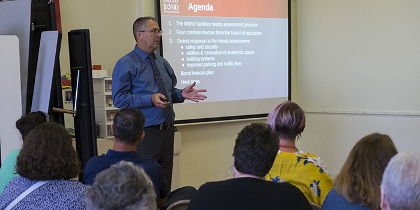

<!DOCTYPE html>
<html>

<head>
	<meta charset="utf-8">
	<meta name="viewport" content="width=device-width">
  <link rel="apple-touch-icon" sizes="180x180" href="images/favicon/apple-touch-icon.png">
  <link rel="icon" type="image/png" sizes="32x32" href="images/favicon/favicon-32x32.png">
  <link rel="icon" type="image/png" sizes="16x16" href="images/favicon/favicon-16x16.png">
  <link rel="manifest" href="images/favicon/site.webmanifest">
	<title>EHS Business Pathways</title>
	<link href="style.css" rel="stylesheet" type="text/css" />
</head>

<body>
	

		<h1> EHS Business Pathways </h1>
	

	

		
    
     
  

  

Business Courses Offered at EHS hover over each image to see list of classes available for each pathway.

  
    <!--dropdowns start here-->
  
        
    
 Business Management 
        + Entrepreneurship

     
    
    <button class="dropbtn"><a href="#">Learn More</a></button>
    

      
Business Management + Entrepreneurship

Introductory Level:  - Business Essentials (12050)  .5 credit  

      
Technical Level:  - Business Communications (12009)  .5 credit  - Business Management (12052)  .5 credit  - Entrepreneurship (12053)  .5 credit  Optional Supportive Courses: - Accounting A & ^B (12104)  1 credit - Building Maintenance (17009)  .5 credit  - CAD Design and Software (21107)  1 credit   - Carpentry (17002)  1 credit  - Child Development (19052) 1 credit  - Consumer & Personal Finance (22210)  .5 credit  - Culinary Essentials (16052)  .5 credit  - Principles of Marketing (12164)  1 credit  - Web Page Design (10201)  1 credit 

      
Application Level:  - Applied Business Development (32200)  1 credit  

    

  

  

    
Marketing
 
     
    <button class="dropbtn"><a href="#">Learn More</a></button>
      

        
Marketing

Introductory Level: - Business Essentials (12050)  .5 credit 

        
Technical Level: - Accounting A & ^B (12104)  1 credit  - Business Communications (12009)  .5 credit  - Business Management (12052)  .5 credit  - Entrepreneurship (12053)  .5 credit  - Graphic Design (05162)  1 credit  - Principles of Marketing (12164)  1 credit  - Web Page Design (10201)  1 credit 

        
Application Level: - Marketing Applications (35300)  1 credit 

      

  

  

    
Finance
 
      
    <button class="dropbtn"><a href="#">Learn More</a></button>
      

        
Finance

Introductory Level: - Business Essentials (12050)  .5 credit 

        
Technical Level:  - Accounting A & ^B (12104)  1 credit  - Consumer & Personal Finance (22210)  .5 credit  Optional Supportive Courses: - Business Communications (12009)  .5 credit  - Entrepreneurship (12053) .5 credit   

        
Application Level:  - College Accounting (33109)  1 credit   - Investing (12107)  .5 credit  

      

    

  
   <h2 id="help1">Course Descriptions</h2>
    <iframe src="https://drive.google.com/file/d/1KEtUHtXD92IVRPzMytrvHgkuEB6GWVRN/preview" width="640" height="480"></iframe>
    

    

      
Emporia High School 3302 W 18th Ave | Emporia, KS 66801 | Contact :<a href="mailto:11175@usd253.net?Subject=Business%20Pathways%20Website" target="_top">11175@usd253.net. </a>
    

    
  </body>
</html>
